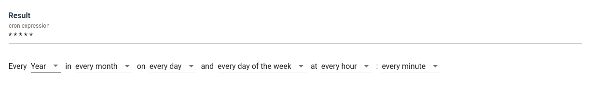

# Vue.js Cron

generate cron expressions using Vue.js



This component is inspired by [react-js-cron](https://github.com/xrutayisire/react-js-cron) and [jqcron](https://github.com/arnapou/jqcron)

# Getting Started

Read the [docs](https://abichinger.github.io/vue-js-cron/)

# Packages

This monorepo includes the following packages:

- core - a renderless Vue.js component to generate cron expressions.
- light - a lightweight cron editor without external dependencies
- vuetify - Vuetify component to edit cron expressions.
- docs - Vue.js Cron documentation with [VuePress](https://vuepress.vuejs.org/)

# Development

## Install dependencies
```
yarn install
```

## Run development server
```
yarn dev-core
yarn dev-vuetify
yarn dev-docs
```

## Test
```
yarn test
```

## Build
```
yarn build
```