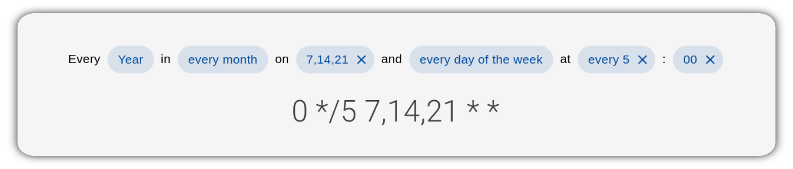

# vue-js-cron 

    <em>generate cron expressions using Vue.js</em>

# Getting Started

Vue v3: [documentation](https://abichinger.github.io/vue-js-cron)

Vue v2: [documentation](https://abichinger.github.io/vue-js-cron/vue2)

# Packages

This monorepo includes the following packages:

- core - a renderless Vue.js component to generate cron expressions.
- light - a lightweight cron editor without external dependencies
- vuetify - Vuetify component to edit cron expressions.
- element-plus - Element Plus component
- ant - Ant Design Vue component
- quasar - Quasar component
- docs - Vue.js Cron documentation powered by [VuePress](https://v2.vuepress.vuejs.org/)

# Contributing and Development

Please have a look at [CONTRIBUTING.md](/CONTRIBUTING.md)

- [Contributing](/CONTRIBUTING.md#contributing)
  - [Setup Development Environment](/CONTRIBUTING.md#setup-development-environment)
  - [Add new localization](/CONTRIBUTING.md#add-new-localization)
  - [Add a new UI Framework](/CONTRIBUTING.md#add-a-new-ui-framework)

## Contributors

## Attribution

This component is inspired by [react-js-cron](https://github.com/xrutayisire/react-js-cron) and [jqcron](https://github.com/arnapou/jqcron)

### Articles

[Renderless Components in Vue.js](https://adamwathan.me/renderless-components-in-vuejs/) by Adam Wathan
 
[Composition API v Renderless Components](https://dev.to/thomasferro/composition-api-v-renderless-components-let-s-use-vue-3-s-features-to-clean-our-components-n25) by Thomas Ferro